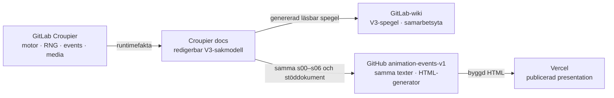
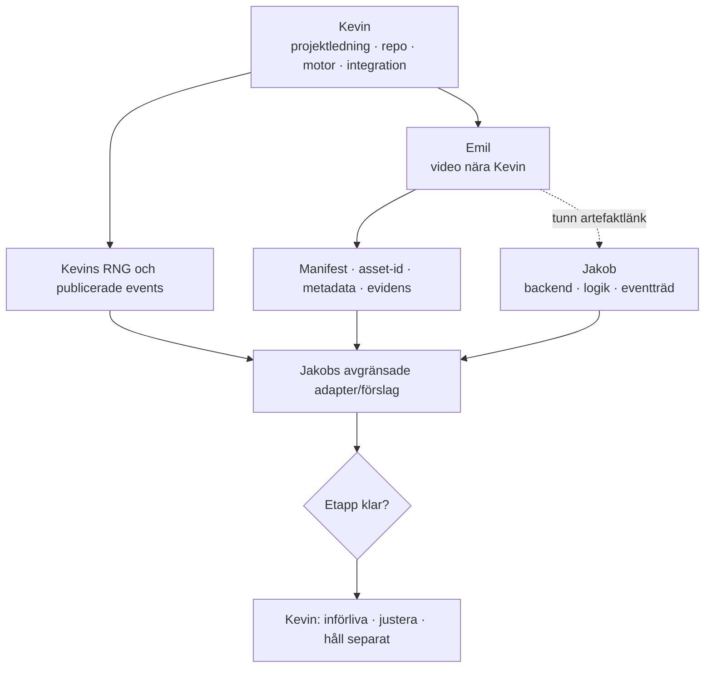

# Canvas och publiceringsflöde · V3

Den interaktiva **webcanvasen öppnas på
[Vercel](https://animation-events-v1.vercel.app/)**. Dess generator och HTML hör
till [GitHub-repot `Jakeminator123/animation-events-v1`](https://github.com/Jakeminator123/animation-events-v1).
GitHub visar källfiler och historik; Vercel visar den körbara presentationen.
Namnet `v1` i adresserna är historiskt och hindrar inte att innehållet är V3.

GitLab-wikins `.html`-kopior kan visas som rå kod och är avsedda för nedladdning,
inte som länkar till en körbar app. V3 här är en HTML-webcanvas, inte en inbäddad
GitLab-app eller en separat `.canvas.tsx`-fil.

## V2-upplägget som V3 behåller

1. Sju redigerbara textsidor: `s00`–`s06`.
2. En självbärande `index.html` med navigation, visuella flöden och samma
   sakmodell som textsidorna.
3. Ett GitHub-repo som versionsstyr canvas och dokumentation.
4. En GitLab-wiki som gör samma V3 tillgänglig för Kevin, Jakob, Emil och
   deras agenter.
5. En redigerbar sakmodell i Croupier-dokumentationen så att varje tekniskt
   påstående kan granskas mot koden det beskriver.

## Källor med olika ansvar

GitHub/Vercel får aldrig bli källa för spelutfall. GitLab-wikin får aldrig
låtsas att ett canvasförslag redan finns i runtime.

## V3:s huvudflöde

## Så hålls ytorna lika

1. Rätta sakmodellen i Croupiers V3-källfiler. Nya mänskliga beslut hänvisar
   till möte eller daterad inboxnotering; ett automatiskt dokumentbygge fattar inga beslut.
2. Generera GitHub-texter och wikivyer från samma källfiler. Anpassa filnamn och
   länkar till respektive yta, men ändra inte innebörden i en enskild spegel.
3. Bygg GitHubs `index.html` från de sju synkade sidorna och kontrollera att
   byggd HTML och speglar inte har glidit isär.
4. Publicera de granskade ändringarna i samma leverans och kontrollera de
   verkliga länkarna. En lokal filändring är inte bevis på en uppdaterad webbplats.

## Förhandsvisning, produktion och historik

- GitHub-brancher kan skapa **automatiska Vercel-förhandsvisningar**. De kan kräva
  Vercel-inloggning och är inte automatiskt den officiella publiceringen.
- [Den stabila webbadressen](https://animation-events-v1.vercel.app/) är
  produktionsytan för dokumentationscanvasen. Promotion dit är ett medvetet
  publiceringssteg, inte en integration av spelkod.
- V2 bevaras oförändrad under [GitHubs `archive/v2/index.html`](https://github.com/Jakeminator123/animation-events-v1/blob/main/archive/v2/index.html)
  och taggen `archive-v2`, även när produktionsadressen visar V3.
- `v3-9-days-mvp` är ett historiskt branch-/katalognamn, inte ett beslutat
  leveransdatum. Befintliga adresser bevaras när läsbara rubriker förbättras.
- Commit- och filreferenser i [det tekniska kvittot](RUNTIME-EVIDENCE.md)
  belägger kodpåståenden. De är inte ett visuellt godkännande eller bevis på
  att alla föreslagna delar redan körs ihop.

---

> Synkad presentationskopia. Redigera [källfilen i Croupier](https://gitlab.com/scout-gg/croupier/-/blob/jakeminator123/work/docs/animation-events/v3-9-days-mvp/CANVAS.md) och kör `tools/sync-docs.mjs` i canvas-repot. Denna kopia är inte en separat besluts- eller runtimekälla.
